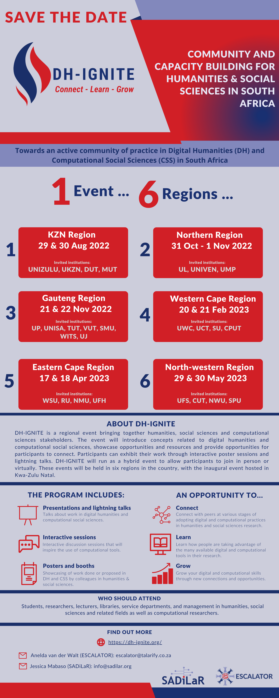

_This post first appeared on the ESCALATOR blogsite at https://escalator.sadilar.org/post/2022/07/dh-ignite/._

ESCALATOR is excited to announce [DH-IGNITE](https://dh-ignite.org), a regional event to bring together humanities, social sciences and computational sciences stakeholders and help foster a community of practice in digital humanities and computational social sciences. Participants will include postgraduate students, researchers, lecturers, librarians, archivists, research enablers, and research management. DH-IGNITE will be hosted in six regions in South Africa  between October 2022 - May 2023. The event will introduce concepts related to digital humanities and computational social sciences, showcase opportunities and resources and provide opportunities for participants to connect. Participants can exhibit their work through interactive poster sessions and lightning talks.

DH-IGNITE will be happening in your region on the following dates: 

- Region 1: KwaZulu Natal - 29 & 30 August 2022 (MUT, DUT, UNIZULU, UKZN)
- Region 2: Gauteng - 2022 - date to be confirmed (UP, UNISA, TUT, VUT, SMU, WITS, UJ)
- Region 3: Western Cape - 2023 - date to be confirmed (UWC, UCT, SU, CPUT)
- Region 4: Eastern Cape - 2023 - date to be confirmed (WSU, RU, NMU, UFH)
- Region 5: North-western region - 2023 - date to be confirmed (UFS, CUT, NWU, SPU)
- Region 6: Northern region - 2023 - date to be confirmed (UL, UNIVEN, UMP)

DH-IGNITE will also provide universities an opportunity to showcase how they support their faculties in adopting digital and computational methodologies and interdisciplinary approaches in humanities and social sciences research. The event will be offered in hybrid format to allow participants to join in person or virtually. Universities are encouraged to host relevant workshops directly before or after DH-IGNITE to bring more learning and networking opportunities to their institutions.

Read more about DH-IGNITE: <https://dh-ignite.org/>

