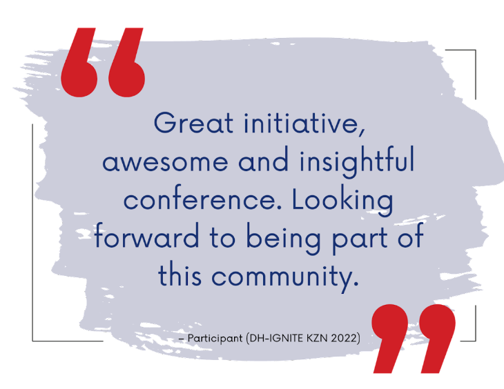
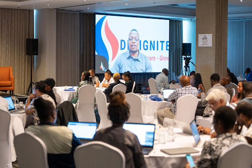

Shifting gears from analogue to digital research doesn’t come easy when you are doing it in isolation. Understanding how to reframe, relearn and reapply research in light of the advancement of technology in society may all seem quite daunting when you’re new to digital humanities (DH) or computational social science (CSS). 

One of the activities included in the ESCALATOR design is the hosting of in-person events to bring community members together and foster a community of practice. This only became viable after the COVID-19 pandemic restrictions were lifted in South Africa.  We then created opportunities for community members from different institutions to connect at regional events across South Africa.

So with great excitement, the ESCALATOR team started planning the first in-person meetup. The inaugural DH-IGNITE conference was held on 18-19 October 2022 in Durban, KwaZulu-Natal.

 

<iframe width="560" height="315" src="https://www.youtube.com/embed/bZ0jQ9lV3_s" title="YouTube video player" frameborder="0" allow="accelerometer; autoplay; clipboard-write; encrypted-media; gyroscope; picture-in-picture; web-share" allowfullscreen></iframe>

 

DH-IGNITE is a hybrid meetup where our community members can 
- connect with peers from the region; 
- learn about resources, tools, and opportunities; and
- grow their skillsets, networks, and footprint. 

During DH-IGNITE KZN, more than 120 participants joined in person or virtually. Participants included students and staff from UNIZULU, DUT, and UKZN, as well as 25 speakers from SADiLaR, ESCALATOR, UNIZULU, DUT, UKZN, Europe and the United States.

The event programme was designed to ensure all participants have an opportunity to make their voices heard. Some were invited to do lightning talks to share how they use digital and computational methodologies in their research projects. Others joined panels to talk about their learning journeys or resources. Roaming microphones were also available to get input and feedback from attendees.

Some exciting visitors included representatives from three organisations that are part of the National Integrated Cyberinfrastructure System (NICIS):
- the Data Intensive Research Initiative of South Africa ([DIRISA](https://www.dirisa.ac.za/))
- the Centre for High-Performance Computing ([CHPC](https://www.chpc.ac.za/)); and
- the South African Research and Education Network ([SANReN](https://www.sanren.ac.za/)).

Although the NICIS is traditionally associated with research in "hard sciences" such as physics, astronomy and bioinformatics, DH-IGNITE was able to include humanities and social sciences into the conversation about infrastructures that support big data research and data science. Participants of DH-IGNITE found the NICIS session very interesting and informative, as is evident from the feedback from one participant who said:

> “The session about NICIS - learning of existing and dedicated infrastructure for researchers was very helpful.“

The feedback from participants and speakers was very positive, and we look forward to the next DH-IGNITE that will be held in the Western Cape from 8 - 10 March 2023.

For more information and access to the application form, please visit https://dh-ignite.org.

